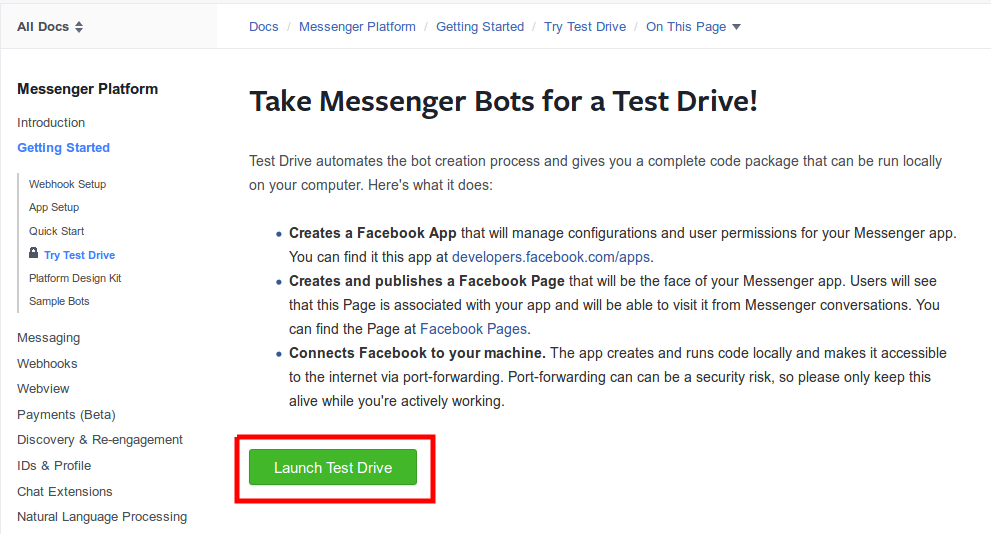
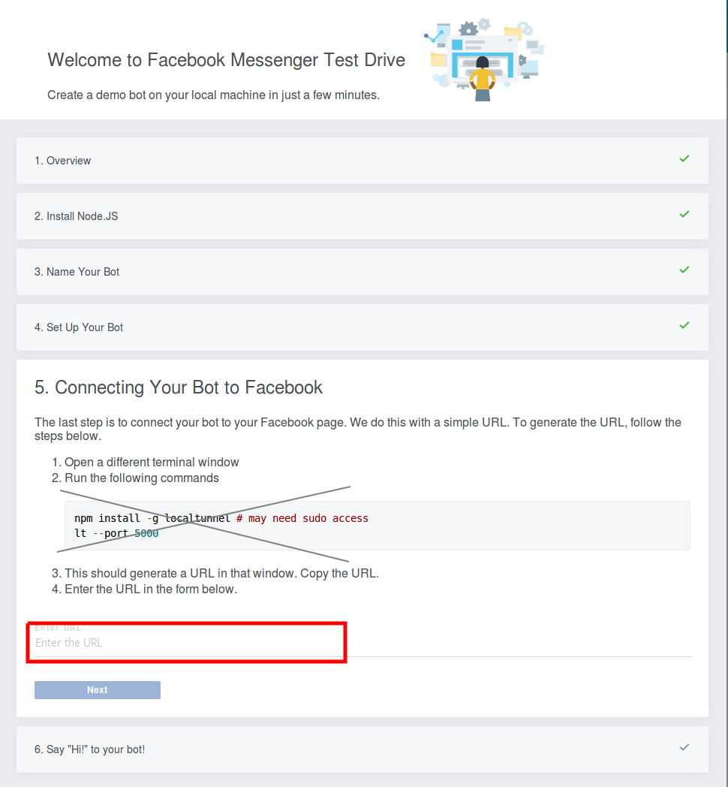
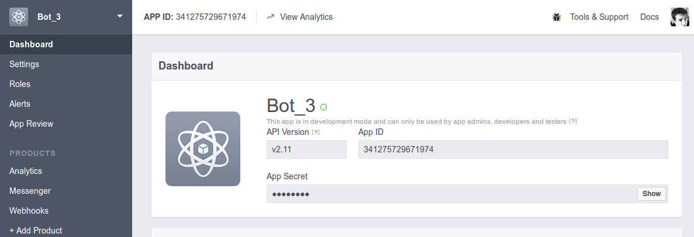
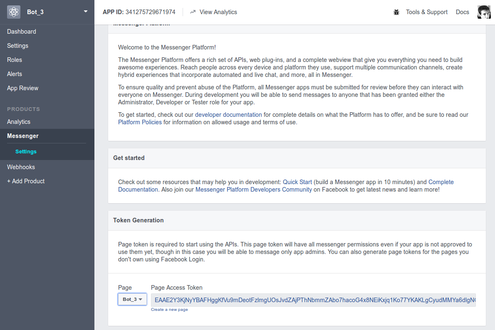
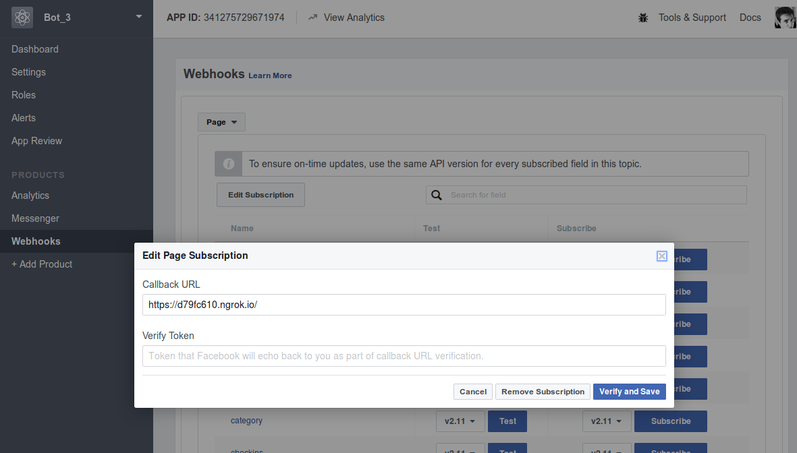

## Paysera Chat Bot Workshop

### Requirements
 * `PHP >=5.5`
 * `composer`
 * [ngrok](https://ngrok.com/download)
 * Facebook Account
 
### Setup instructions
 
 #### PHP server
 For simplicity of this task, we will use built-in PHP server.
 * install dependencies with `composer install`
 * from project's directory run in console `php -S localhost:9999`.
 * check local PHP server is running - in browser go to `http://localhost:9999/` - you should see a blank page.
 
 #### ngrok
 Ngrok is local proxy allowing your PC to be accessible from Internet.
 * download `ngrok` from https://ngrok.com/download and extract it in project directory.
 * make sure it is executable - run in console: `./ngrok`.
 * start `ngrok` to have public proxy - `./ngrok http 9999`.
 * make sure everything is OK with `ngrok` by going to [http://127.0.0.1:4040/inspect/http](http://127.0.0.1:4040/inspect/http)

 #### Facebook App Setup
 
 1. Go to [Messenger API platform](https://developers.facebook.com/docs/messenger-platform) and click `Try It now`
  

 1. Launch Test Drive: 
 1. Fill required steps: 
    1. Check the checkbox
    1. Skip Node.JS installation
    1. Enter chat bot name - must start with capital letter
    1. Skip package download - we do not need it
    1. Fill url you got from `ngrok` setup - do not press `Next`, you will get an error 
    1. In another browser tab go to [Facebook Apps](https://developers.facebook.com/apps)
    1. Click on App with your chat bot name (You filled it in `Step 3`)
    1. Save the `App ID` and `App Secret` - in configuration file 
    1. Go to `Messenger` in `Products` sidebar
    1. Under `Token Generation` select `Page` with same name as your chat bot name, save the `Page Access Token` in configuration 
    1. Go to previous browser tab and click `Next` in `Step 5`
 1. If everything was according to plan, you can open Messenger, search for chat bot and he should reply to you.

 #### Changed ngrok hostname?
 In case you restarted `ngrok`, you will receive a new public hostname, you need to change it in `App Webhooks`
 
